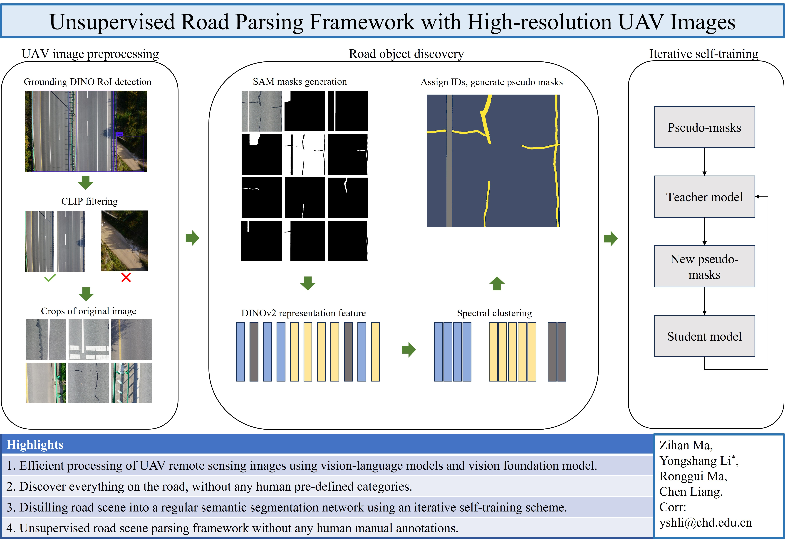

# Unsupervised Road Parsing
Two challenges are presented when parsing road scenes in UAV images. First, the high resolution of UAV images makes processing difficult. Second, supervised deep learning methods require a large amount of manual annotations to train robust and accurate models. In this paper, an unsupervised road parsing framework that leverages recent advances in vision language models and fundamental computer vision model is introduced.
Initially, a vision language model is employed to efficiently process ultra-large resolution UAV images to quickly detect road regions of interest in the images. Subsequently, the vision foundation model SAM is utilized to generate masks for the road regions without category information. Following that, a self-supervised representation learning network extracts feature representations from all masked regions. Finally, an unsupervised clustering algorithm is applied to cluster these feature representations and assign IDs to each cluster. The masked regions are combined with the corresponding IDs to generate initial pseudo-labels, which initiate an iterative self-training process for regular semantic segmentation. The proposed method achieves an impressive 89.96% mIoU on the development dataset without relying on any manual annotation. Particularly noteworthy is the extraordinary flexibility of the proposed method, which even goes beyond the limitations of human-defined categories and is able to acquire knowledge of new categories from the dataset itself.




## Dataset
* [Images](https://chdeducn-my.sharepoint.com/:u:/g/personal/2018024008_chd_edu_cn/EbJFezmdsL1Dt9DraDJtpusB-rNgdeyzx8FBRpIrCvYKhA?e=p64byd)
* [Pseudo_label_by_clustering](https://chdeducn-my.sharepoint.com/:u:/g/personal/2018024008_chd_edu_cn/EcyYtTCmtbBImydwgRz6LbgBwea3NeKtJWoItHHN-O85-Q?e=lSBSsx)

## Under review. Please stay tuned.

## Preprint
```bibtex
@misc{ma2024unsupervised,
      title={Unsupervised semantic segmentation of high-resolution UAV imagery for road scene parsing}, 
      author={Zihan Ma and Yongshang Li and Ronggui Ma and Chen Liang},
      year={2024},
      eprint={2402.02985},
      archivePrefix={arXiv},
      primaryClass={cs.CV}
}
```
